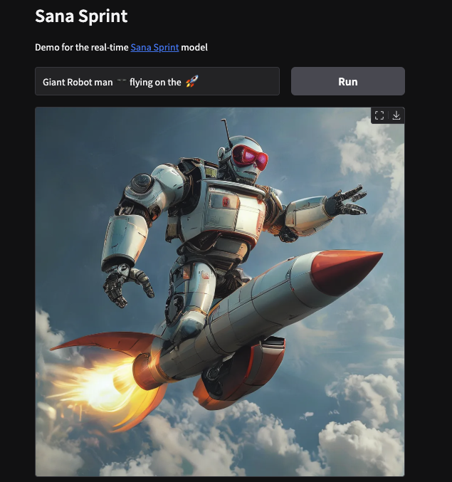

<div align="center">
  <h1>Sana Sprint GUI for Local Generation</h1>
  
  <p><strong>Real-time Text-to-Image Generation Interface</strong></p>
  <p>🖼️ Image Generation | 🌍 Gradio UI | ⚡ Fast | 🎨 Beautiful | 🧠 AI-Powered</p>
  <p>
    
    
    
    
  </p>
</div>


Here is the demo Sana Sprint reference app [https://huggingface.co/spaces/Efficient-Large-Model/SanaSprint] configured to work on a mac or linux host. It will probably works on WSL.  I just repackaged this to work on Macs and Linux with some minor code changes.  

> The model has it's own commerical license you should review.

> On Mac only the .6b seems to generate

---


### To Setup and Run
```
git clone https://github.com/ramborogers/sanasprint 
cd SanaSprint
sh setup.sh
```

### To Run Later
```
cd SanaSprint
source .venv/bin/activate
python app.py
```

---

<div align="center">

## ⚖️ License

<p>
Sana Sprint (GUI) is licensed under the GNU General Public License v3.0 (GPLv3).<br>
<em>Free Software</em>
</p>

[](https://www.gnu.org/licenses/gpl-3.0)

### Connect With Me 🤝

[](https://github.com/RamboRogers)
[](https://x.com/rogerscissp)
[](https://matthewrogers.org)

</div>